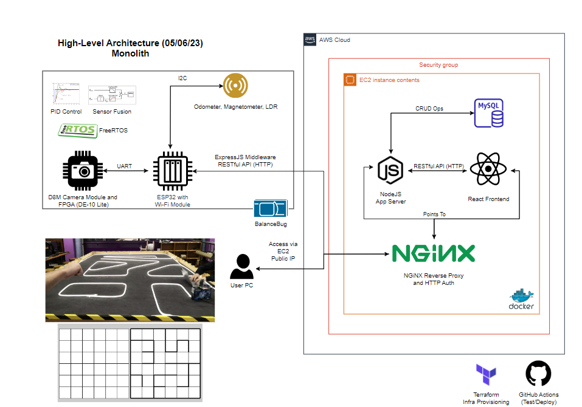

# BalanceBug

## Team Members

Hubert Choo, Lee Jian Rong, Yomna Mohamed, Shermaine Ang, Samsam Lee, Clemen Kok

## Folder Structure

```
├── .github/workflows // contains CI/CD scripts
├── chassis // physical design files
├── control // contains all code related to microcontroller, arduino and esp32
├── frontend // frontend stuff react
├── img // README images
├── report // contains report data (drafts, assets etc)
├── vision // contains code for vision subsystem
└── website // contains code for react app, nodejs server
```

## Setup

Node version used in production: node-18. 

If you just want to test your function in isolation, create a new folder within your subsystem and run `npm init` and follow the corresponding instructions. You will then need to run `npm -i express axios cors` as these are the packages related to setting up API middleware. `node server.js` for example runs the `server.js` file. I strongly recommend doing this first to incorporate a test-driven approach.

To integrate and test the Node server as a whole, first make sure your system has Docker installed. Docker is a configuration management tool where we can pull images from a central repository. You can find the installation instructions online. You will need to install the `mysql` image and run it. With Docker installed (and the daemon running), run the following commands:

```
docker pull mysql/mysql-server:latest
docker run -p3306:3306 --name=mysql1 -d mysql/mysql-server:latest
```

Now, run `cd website && npm -i`. This will install all the dependencies as indicated in the `package.json` file. Run `npm start` to test the Node server. 

To integrate the ESP32 and bridge the connection without deploying to production, use [ngrok](https://ngrok.com/download). This establishes a secure tunnel into your localhost so the ESP32 can communicate with the server. Once done, you will need to pull the ngrok image and then start the container via `docker run -it -e NGROK_AUTHTOKEN=$NGROK_AUTHTOKEN ngrok/ngrok:latest http host.docker.internal:8080`. Replace `$NGROK_AUTHTOKEN` with your own auth token. You should now be able to copy the ngrok URL in the terminal and use it as a replacement for `localhost:8080`.  

To test the whole stack, run `docker-compose up -d`. Docker Compose is a tool that lets us set up and network multiple docker containers at once. Run `docker-compose up` if you want to investigate logs. `docker-compose ps` will tell you the status of active containers. Make sure you run `docker-compose down` when done. 

## API Routing

The architectural style that we use to interface between different components of our system is RESTful API. A quick tutorial on how to set one up. The gist is that a RESTful API is a URL that we can access to send data to an endpoint. It can take place as GET, POST, UPDATE, DELETE, PUT, PATCH. We will most likely use GET and POST. More details on GET and POST can be found in `website/controllers/utils.controllers.js`.  

You can find the guidelines on how to set up your API to perform a function via the following files: `website/routes/utils.routes.js` and `website/controllers/utils.controllers.js`. 

## System Architecture



## A set of useful commands

```
docker pull mysql/mysql-server:latest
docker run -p3306:3306 --name=mysql1 -d mysql/mysql-server:5.7
docker exec -it mysql1 mysql -uroot -p
docker run
docker run -it -e NGROK_AUTHTOKEN=$NGROK_AUTHTOKEN ngrok/ngrok:latest http host.docker.internal:8080
```

## Wall Following Algorithm

CASE I: FOLLOW THE WALL. When the rover encounters a wall, keep following the wall. Periodically send over deadreckoning data via POST requests to the server (this means distance moved and bearing). Use interrupts/RTOS to allow simultaneous action by the microcontroller. The map is to be updated in real-time on the server's memory. This is concurrently stored into the database and is polled asynchronously by React to update the UI.  

CASE II: TURN THE CORNER. Assume the rover can follow light along a corner. We accumulate changes in angle via the gyroscope and if the angle exceeds X degrees, set a boolean case_i to 0 to stop the Case I while loop. The rover stops and sends a POST request to the server to indicate turn of corner. The server sends POST requests to the Raspberry Pi web servers to turn on the beacons (starting with 1 beacon out of 3). The ESP will send POST requests containing data on HSV height to the server by taking multiple readings as it turns to build a complete histogram. The server will determine when accurate measurements of 1 beacon distance have been obtained before sending another POST request to turn on the 2nd beacon. This repeats until we have data on all 3 beacon distances allowing us to use our non-linear regression method to obtain the rover's accurate position on the map. This is marked on our in-memory map.  

The rover position is saved concurrently to the DB and is polled by react and reflected on the frontend.  

CASE III: LOOP CLOSURE. TBD  

