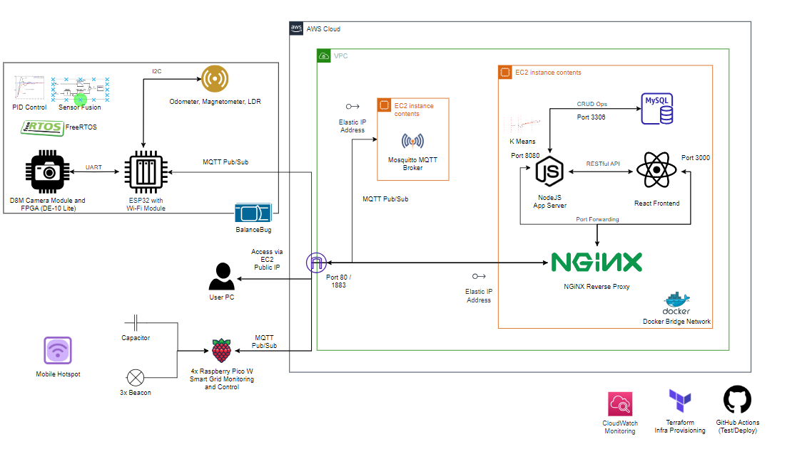

<p align="center">
  <a href="http://intranet.ee.ic.ac.uk/electricalengineering/eecourses_t4/course_content.asp?c=ELEC50003&s=I2#start">
    
  </a>
</p>


<div align="center">
  <h1>BalanceBug</h1>
  
<p>
  Self-Balancing Autonomous Maze Solver from Imperial EEE
</p>

</div>

# Table of contents

* [Team Members](#team-members)
* [What is this project?](#what-is-this-project)
* [Setup](#setup)

## What is this project?



This project presents the design, development, and evaluation of an autonomous self-balancing rover capable of navigating and surveying mazes. The main goals of the project were to achieve stable self-balancing motion, efficient and complete maze exploration, and accurate path planning for the shortest route between arbitrary points. The rover's self-balancing mechanism utilised a cascaded control loop and an additional loop for rotational control. A comprehensive maze exploration strategy was employed to ensure complete coverage and identification of all walls. A real-time operating system, FreeRTOS, was used to integrate hardware submodules for concurrent execution. Image segmentation techniques were used for beacon differentiation, enabling accurate localization. Pathfinding was performed using the A* algorithm, and all algorithms developed were integrated on Node.js and deployed on the AWS Cloud. Extensive evaluations, including unit tests and maze navigation experiments, demonstrated the rover's successful performance in mapping and navigating the maze.  

Keywords: self-balancing rover, maze navigation, surveying, autonomous, image segmentation, pathfinding, FreeRTOS

## Team Members

Hubert Choo, Lee Jian Rong, Yomna Mohamed, Shermaine Ang, Samsam Lee, Clemen Kok

## Setup

### ESP32

Please flash the code in `main.cpp`, located in the `control/RTOS` folder. Note that RTOS was not implemented in the end due to us not needing to multitask (velocity loop was not used for our demonstration).

### Node

Node version used in production: node-18. I assume you have Node installed. If not, go to [here](https://nodejs.org/en/download).   

If you just want to test your function in isolation, create a new folder within your subsystem and run `npm init` and follow the corresponding instructions. You will then need to run `npm -i mqtt` as these are the packages related to setting up MQTT middleware. `node server.js` for example runs the `server.js` file. I strongly recommend doing this first to incorporate a test-driven approach.

### Docker

To integrate and test the Node server as a whole, first make sure your system has Docker installed. Docker is a configuration management tool where we can pull images from a central repository. You can find the installation instructions online. You will need to install the `mysql` image and run it. With Docker installed (and the daemon running), run the following commands. We need to set up our database container. See the docs [here](https://hub.docker.com/r/mysql/mysql-server).  

First we pull the latest docker image for mysql.  

```
docker pull mysql/mysql-server:latest
```

Then we run the image, mapping port 3306 on the container to our local system's port 3306. We name the container mysql1.   

```
docker run -p3306:3306 --name=mysql1 -d mysql/mysql-server:latest
```

Afterwards we find the random first password for mysql1. If you are using a windows-based system, replace grep with findstr.  

```
docker logs mysql1 2>&1 | grep GENERATED
[Entrypoint] GENERATED ROOT PASSWORD: -odOg(aMAMydAfC@g2aL]uPk@vv << Copy this set of random characters
```

We then access the mysql database as root, and key in the randomly generated password. We then create a superuser so we can access the database as root from anywhere.  

```
docker exec -it mysql1 mysql -uroot -p
Enter password: 
... << Key the characters in
mysql> ALTER USER 'root'@'localhost' IDENTIFIED BY '123456';
mysql> create database testdb;
```

Now, run `cd MQTT_Backend && npm -i`. This will install all the dependencies as indicated in the `package.json` file. Run `npm run start` to test the Node server.  

Set up the MQTT Server and then just input its IP address.   

(NOTE: Production Only!) To test the whole stack, run `docker-compose up -d`. Docker Compose is a tool that lets us set up and network multiple docker containers at once. Run `docker-compose up` if you want to investigate logs. `docker-compose ps` will tell you the status of active containers. Make sure you run `docker-compose down` when done.  

### Linting

A Linter (ESLint) has been installed to fix JavaScript bugs in development instead of cascading these bugs into production. Install it via `npm install -g eslint`. Linter configurations have already been added, you simply need to enable the ESLint VSCode extension and then modify your `.vscode` settings with the following lines:

```
    "eslint.workingDirectories": [
    "./MQTT_Backend", 
    "./frontend"
    ]
```

### API Routing

The architectural style that we use to interface between the frontend anc backend of our system is RESTful API. A quick tutorial on how to set one up. The gist is that a RESTful API is a URL that we can access to send data to an endpoint. It can take place as GET, POST, UPDATE, DELETE, PUT, PATCH. We will most likely use GET and POST.  

NOTE: Axios fetches from the `live_databases` table using a counter that increases once every fetch (we poll every 500ms). It does this by matching to the id inside the table, which is automatically added and increases by 1 each time a new record is added. NOTE, don't DELETE from the table else there will be a lag in between newly added records and the counter. The counter also increases by 0.5 due to the fact that `ComponentDidMount()` runs twice.  

MQTT is used to connect the IoT devices to the backend server.  


### A set of useful commands

```
docker pull mysql/mysql-server:latest
docker run -p3306:3306 --name=mysql1 -d mysql/mysql-server:5.7
docker exec -it mysql1 mysql -uroot -p
```


### Unit Test on Server Database API and Maze Routing Algorithm

To verify the correctness of our server's database API and maze routing algorithm, we decided to perform unit testing with the aid of the [Mocha Javascript Test Framework](https://mochajs.org/).

[Unit Test Report](./MQTT_Backend/test/unittest.md)

[Smoke Test Report](./MQTT_Backend/smoketest/smoketest.md)


### Checklist

- Turn on hotspot for Raspberry Pi and ESP32
- Ensure that AWS EC2 MQTT broker is started
- Plug in IP address of EC2 MQTT into ESP32 and nodejs
- SSH into EC2 instance and monitor the keep alive topic 
- Start `mysql1` container in docker
- Input new map dimensions in `MQTT_subscribers.js`
- `npm start` nodejs server
- Open `localhost:8080/newmapping` on chrome
- Flash ESP while it is disconnected from the blue breakout board
- Plug in ESP32 to break out board and disconnect it from computer
- Switch on PSU AND green pcb switch
- Test sockets
- Change map region and graph domain if needed