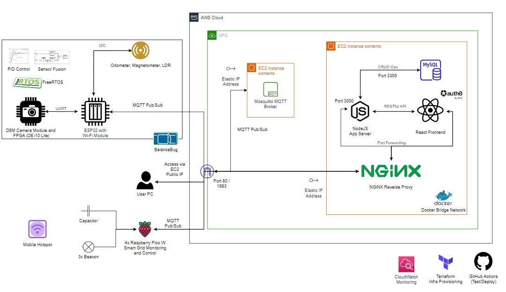

<p align="center">
  <a href="http://intranet.ee.ic.ac.uk/electricalengineering/eecourses_t4/course_content.asp?c=ELEC50003&s=I2#start">
    
  </a>
</p>


<div align="center">
  <h1>BalanceBug</h1>
  
<p>
  Self-Balancing Autonomous Maze Solver from Imperial EEE
</p>

[](https://github.com/clemenkok/BalanceBug/actions/workflows/build_test_deploy.yml)
  
</div>

# Table of contents

* [Team Members](#team-members)
* [Setup](#setup)
* [What is this project?](#what-is-this-project)


## Team Members

Hubert Choo, Lee Jian Rong, Yomna Mohamed, Shermaine Ang, Samsam Lee, Clemen Kok

## Setup

Node version used in production: node-18. I assume you have Node installed. If not, go to [here](https://nodejs.org/en/download).   

If you just want to test your function in isolation, create a new folder within your subsystem and run `npm init` and follow the corresponding instructions. You will then need to run `npm -i mqtt` as these are the packages related to setting up MQTT middleware. `node server.js` for example runs the `server.js` file. I strongly recommend doing this first to incorporate a test-driven approach.

### Docker

To integrate and test the Node server as a whole, first make sure your system has Docker installed. Docker is a configuration management tool where we can pull images from a central repository. You can find the installation instructions online. You will need to install the `mysql` image and run it. With Docker installed (and the daemon running), run the following commands. We need to set up our database container. See the docs [here](https://hub.docker.com/r/mysql/mysql-server).  

First we pull the latest docker image for mysql.  

```
docker pull mysql/mysql-server:latest
```

Then we run the image, mapping port 3306 on the container to our local system's port 3306. We name the container mysql1.   

```
docker run -p3306:3306 --name=mysql1 -d mysql/mysql-server:latest
```

Afterwards we find the random first password for mysql1. If you are using a windows-based system, replace grep with findstr.  

```
docker logs mysql1 2>&1 | grep GENERATED
[Entrypoint] GENERATED ROOT PASSWORD: -odOg(aMAMydAfC@g2aL]uPk@vv << Copy this set of random characters
```

We then access the mysql database as root, and key in the randomly generated password. We then create a superuser so we can access the database as root from anywhere.  

```
docker exec -it mysql1 mysql -uroot -p
Enter password: 
... << Key the characters in
mysql> ALTER USER 'root'@'localhost' IDENTIFIED BY '123456';
mysql> create database testdb;
```

Now, run `cd MQTT_Backend && npm -i`. This will install all the dependencies as indicated in the `package.json` file. Run `npm run start` to test the Node server.  

Ask Clemen to set up the MQTT Server and then just input its IP address.   

(NOTE: Production Only!) To test the whole stack, run `docker-compose up -d`. Docker Compose is a tool that lets us set up and network multiple docker containers at once. Run `docker-compose up` if you want to investigate logs. `docker-compose ps` will tell you the status of active containers. Make sure you run `docker-compose down` when done.  

### Linting

A Linter (ESLint) has been installed to fix JavaScript bugs in development instead of cascading these bugs into production. Install it via `npm install -g eslint`. Linter configurations have already been added, you simply need to enable the ESLint VSCode extension and then modify your `.vscode` settings with the following lines:

```
    "eslint.workingDirectories": [
    "./MQTT_Backend", 
    "./frontend"
    ]
```

### API Routing

The architectural style that we use to interface between the frontend anc backend of our system is RESTful API. A quick tutorial on how to set one up. The gist is that a RESTful API is a URL that we can access to send data to an endpoint. It can take place as GET, POST, UPDATE, DELETE, PUT, PATCH. We will most likely use GET and POST.  

MQTT is used to connect the IoT devices to the backend server.  

### System Architecture



### A set of useful commands

```
docker pull mysql/mysql-server:latest
docker run -p3306:3306 --name=mysql1 -d mysql/mysql-server:5.7
docker exec -it mysql1 mysql -uroot -p
docker run
docker run -it -e NGROK_AUTHTOKEN=$NGROK_AUTHTOKEN ngrok/ngrok:latest http host.docker.internal:8080
```

## What is this project? 

CASE I: FOLLOW THE WALL. When the rover encounters a wall, keep following the wall. Periodically send over deadreckoning data via POST requests to the server (this means distance moved and bearing). Use interrupts/RTOS to allow simultaneous action by the microcontroller. The map is to be updated in real-time on the server's memory. This is concurrently stored into the database and is polled asynchronously by React to update the UI.  

CASE II: TURN THE CORNER. Assume the rover can follow light along a corner. We accumulate changes in angle via the gyroscope and if the angle exceeds X degrees, set a boolean case_i to 0 to stop the Case I while loop. The rover stops and sends a POST request to the server to indicate turn of corner. The server sends POST requests to the Raspberry Pi web servers to turn on the beacons (starting with 1 beacon out of 3). The ESP will send POST requests containing data on HSV height to the server by taking multiple readings as it turns to build a complete histogram. The server will determine when accurate measurements of 1 beacon distance have been obtained before sending another POST request to turn on the 2nd beacon. This repeats until we have data on all 3 beacon distances allowing us to use our non-linear regression method to obtain the rover's accurate position on the map. This is marked on our in-memory map.  

The rover position is saved concurrently to the DB and is polled by react and reflected on the frontend.  

CASE III: LOOP CLOSURE. TBD  

