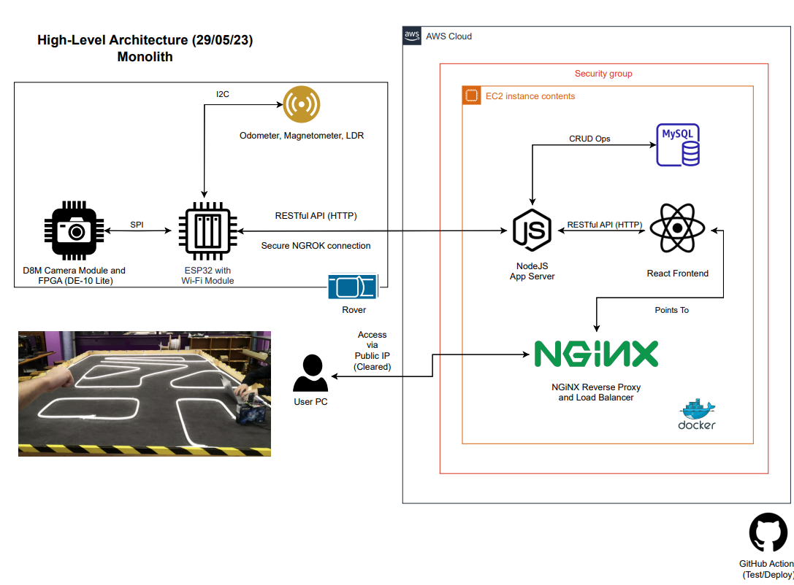

# BalanceBug

## Team Members

Hubert Choo, Lee Jian Rong, Yomna Mohamed, Shermaine Ang, Samsam Lee, Clemen Kok

## Folder Structure

```
├── .github/workflows // contains CI/CD scripts
├── chassis // physical design files
├── control // contains all code related to microcontroller, arduino and esp32
├── frontend // frontend stuff react
├── img // README images
├── report // contains report data (drafts, assets etc)
├── vision // contains code for vision subsystem
└── website // contains code for react app, nodejs server
```

## API Routing

The architectural style that we use to interface between different components of our system is RESTful API. A quick tutorial on how to set one up. The gist is that a RESTful API is a URL that we can access to send data to an endpoint. It can take place as GET, POST, UPDATE, DELETE, PUT, PATCH. We will most likely use GET and POST. More details on GET and POST can be found in `website/controllers/utils.controllers.js`.  

You can find the guidelines on how to set up your API to perform a function via the following files: `website/routes/utils.routes.js` and `website/controllers/utils.controllers.js`. Please let me know if you have any questions.  

## System Architecture



## A set of useful commands

```
docker pull mysql/mysql-server:latest
docker run -p3306:3306 --name=mysql1 -d mysql/mysql-server:5.7
docker exec -it mysql1 mysql -uroot -p
docker run
docker run -it -e NGROK_AUTHTOKEN=$NGROK_AUTHTOKEN ngrok/ngrok:latest http host.docker.internal:8080
```